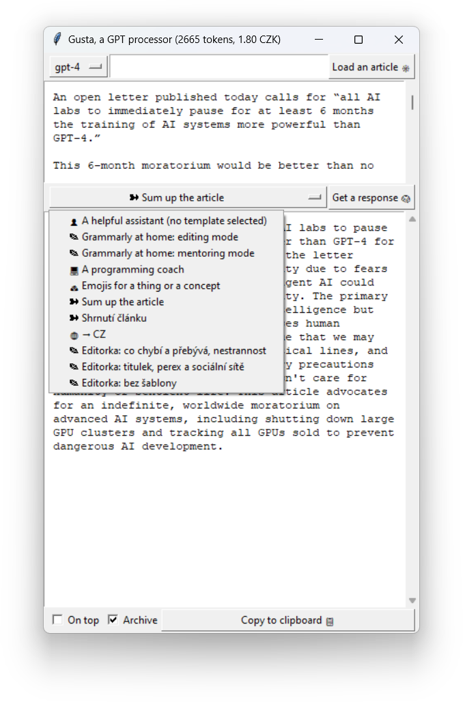

# Gusta the GPT prompt processor

Living with ADHD, I hate these things about ChatGPT:

- It takes ages for the chat interface to finally load.
- It's such a pain to type out the same prompts over and over again.
- Too often, I switch tabs while waiting for the response to appear, and then later, I accidentally close the tab with the response without ever seeing it.

So, I created Gusta - the GPT prompt processor.

- Gusta allows you to choose from prompt templates, both default and custom.
- It saves the prompts and responses in JSON files. This feature can be turned off.
- A text of an article can be scraped with a single click for further manipulation.
- The price of the last job is shown in either dollars or your preferred currency.



## Table of Contents

1. [Installation](#installation)
2. [Usage](#usage)
3. [Contributing](#contributing)
4. [License](#license)

## Installation

1. Run `pip install git+https://github.com/michalkasparek/gusta.git@master` to install the code and its dependencies.

2. Rename `config.user_sample.json` to `config.user.json`. Open it and paste your API key ([https://platform.openai.com/account/api-keys](https://platform.openai.com/account/api-keys)) in the `key` field, then save the file.

## Usage

After installing the dependencies and entering your API key into `config.user.json`, launch the app from your terminal:

```
gusta
```

If you want to add your own templates, add them to the `template` section in the `config.user.json` file. Each template has three parts: the system prompt, the first part of the actual prompt and then the second part of the actual prompt. The user's input is automatically inserted between the first and the second part of the actual prompt. Get inspiration from the sample templates included in the file.

## Contributing

To work on the project:

1. Clone the repository:

   ```
   git clone https://github.com/michalkasparek/gusta.git
   ```

2. Navigate to the project directory:

   ```
   cd gusta
   ```

3. Use [Poetry](https://python-poetry.org/) to install the dependencies:

   ```
   poetry install
   ```

### To-do

- Exception handling has not been implemented yet, which means there are no error messages. Some of the usual cases:
   - Bad API key.
   - The input is too long.
   - GPT servers are down.
   - Problems with internet connection.
- Some parts of the interface disappear when the window is resized below certain size.

## License

Gusta is licensed under the MIT License.
